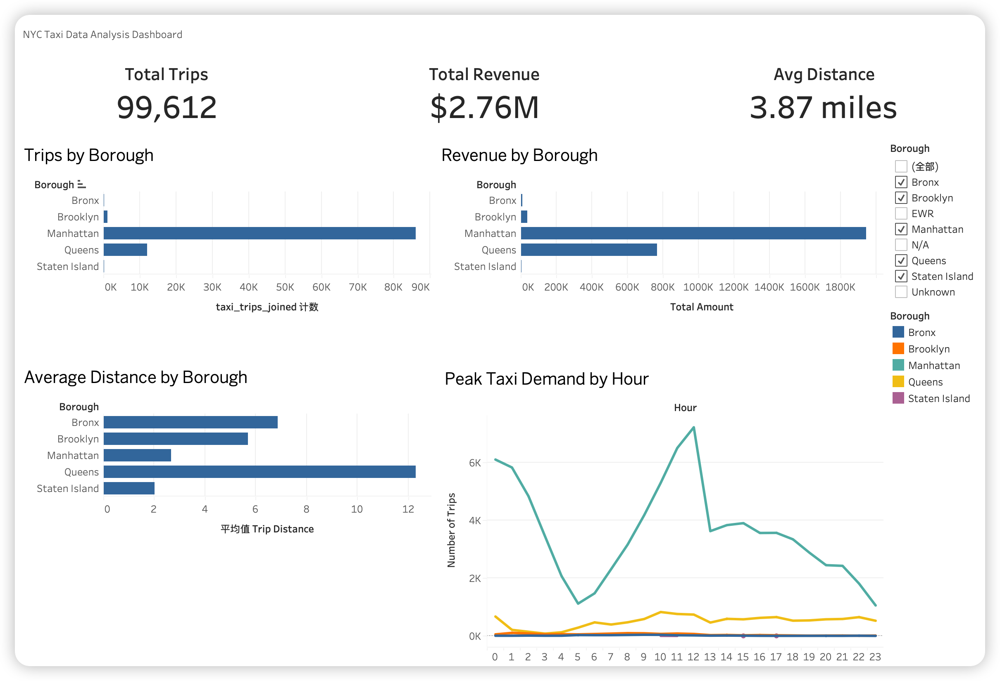
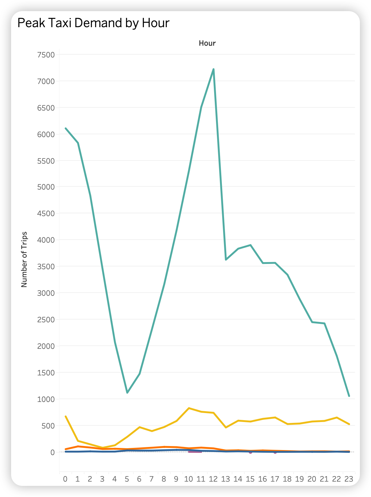
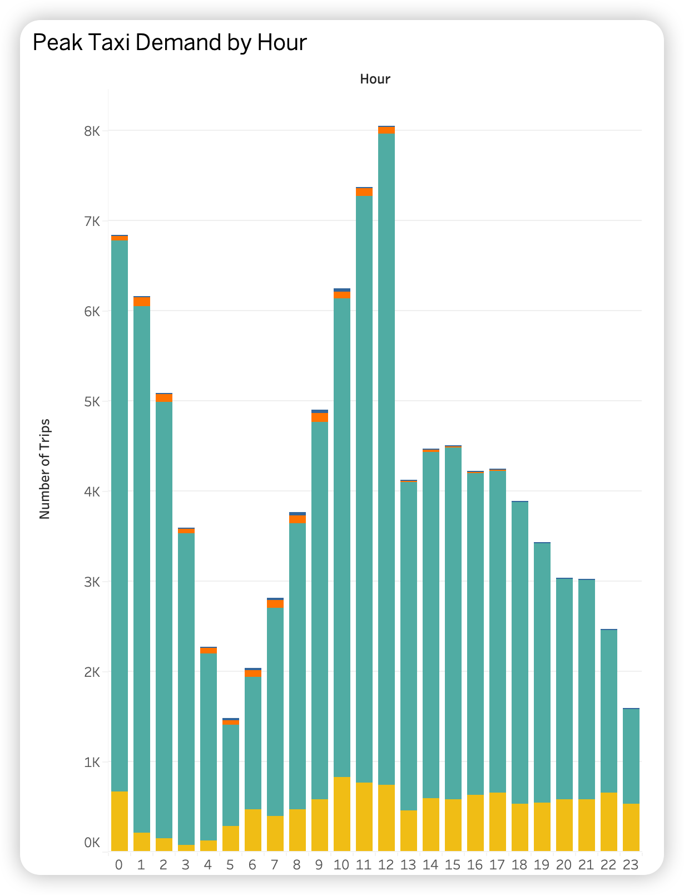

# NYC Taxi Data Analysis

## Project Overview

This project is about analyzing NYC taxi trip data using PostgreSQL and Tableau.
I wanted to explore how taxi demand changes across different boroughs and time periods, and build a simple dashboard to visualize the results.

---

## Tools Used

* PostgreSQL (for storing and querying data)
* SQL (for analysis)
* Tableau (for visualization)

---

## What I Did

* Imported taxi trip data and zone data into PostgreSQL
* Created tables and a joined view (`taxi_trips_joined`)
* Wrote SQL queries to calculate trips, revenue, and average distance
* Built a Tableau dashboard to present the results

---

## Dashboard



---

## Key Visualizations

**Peak Taxi Demand by Hour**



**Revenue by Borough**



---

## Main Findings

* Most taxi trips happen in Manhattan
* Manhattan also generates the highest total revenue
* Taxi demand is higher during daytime hours compared to early morning

---

## Project Structure

```bash
nyc-taxi-analysis/
├── data/
├── sql/
├── dashboard/
├── images/
└── README.md
```

---

## Notes

* The original dataset is quite large, so it is not included in this repository
* You can download it from the official NYC Taxi dataset website

---

## Author

Haisheng Sun
